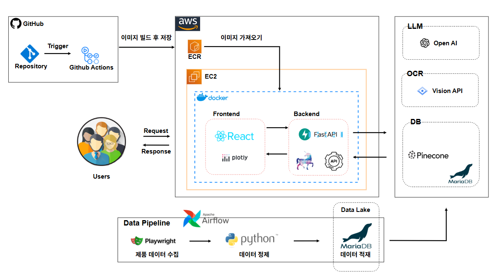

<!-- Improved compatibility of back to top link -->

 

  

<h3 align="center">💄 Alere — 챗봇 기반 화장품 상담 서비스</h3>

  

    AI가 통합한 데이터(수천 개 리뷰 + 상품, 성분 분석 + 효능 데이터)를 통해 화장품 성분 분석 및 구매 가이드를 제공하는 플랫폼 
  

---

  
📋 Table of Contents

- <a href="#team-members">Team Members</a>
- <a href="#about-the-project">About The Project</a>
- <a href="#built-with">Built With</a>
- <a href="#key-features">Key Features</a>
- <a href="#system-architecture">System Architecture</a>
- <a href="#erd">ERD</a>
- <a href="#getting-started">Getting Started</a>
- <a href="#usage">Usage</a>
- <a href="#contact">Contact</a>

---

## 👥 Team Members

|  |  |  |  |  |
| :----------------------------------------------------------: | :----------------------------------------------------------: | :-----------------------------------------------------------: | :----------------------------------------------------------: | :----------------------------------------------------------: |
|              🧠 **배형진** 팀 리더 / 백엔드               |          💻 **김지희** 프론트엔드 / 데이터 분석           |           🧾 **이은영** 프론트엔드 / 데이터 분석           |                   ⚙️ **이정석** 백엔드                    |               🎤 **박상준** 발표자 / 문서화               |
|      FastAPI · 데이터 파이프라인 · AI 모델 연동 · 배포       |           React · Next.js · UI/UX · 추천 루틴 설계           |         문서 · 추천 루틴 설계 · 테스트 시나리오 작성          |      데이터 파이프라인 · Pinecone 임베딩 · 유사도 계산       |       성분 DB 구축 · 피부타입 점수 계산 · README 정리        |

(<a href="#readme-top">back to top</a>)

---

## 🧠 About The Project

> **Alere**는 사용자의 피부 타입, 성분 분석, 리뷰 기반 데이터 시각화를 통해  
> “피부에 맞는 화장품과 향수, 케어 루틴을 자동 추천하는 AI 기반 플랫폼”입니다.

💧 바우만 피부타입 분석 + 📷 성분 추출(OCR) + 🔍 실시간 상담 챗팅 +  
💡 가상 피부 시뮬레이션 + 맞춤형 루틴 추천까지 한 번에 제공합니다.

![Product Screenshot][Product Screenshot]

[Product Screenshot]: ./images/product_screenshot.png

(<a href="#readme-top">back to top</a>)

---

## ⚙️ Built With

이 프로젝트는 여러 최신 기술 스택을 통합하여 구성되었습니다.

- 
- 
- 
- 
- 

(<a href="#readme-top">back to top</a>)

---

## 🌟 Key Features

| 기능명                   | 설명                                                                                            |
| ------------------------ | ----------------------------------------------------------------------------------------------- |
| 🧬 가상피부 시뮬레이션   | 사용자의 피부 타입(바우만 피부타입)을 기반으로 화장품 성분 즉시 비교 분석, 객관적인 점수로 반환 |
| 💐 맞춤 향수 추천        | 사용자 선택 기반 향 성분 매칭을 통한 맞춤형 향수 추천                                           |
| 💧 맞춤 케어 루틴 추천   | 계절, 시간대별, 사용사 선택 키워드 반영한 루틴을 추천                                           |
| 🔍 피부타입 간단 진단    | 설문 기반 바우만 피부타입 간이 테스트                                                           |
| 📊 리뷰 기반 시각화      | 리뷰 데이터를 이용한 인기 제품 탐색, 리뷰 증가율 및 평점 기반 랭킹 시각화                       |
| ⚡ 실시간 화장품 AI 추천 | Pinecone 벡터 검색 기반 유사 제품 실시간 추천                                                   |
| 🧾 OCR 연동 성분 분석    | 사진 업로드 → 성분 자동 추출 → 주의성분 색상 표시                                               |

(<a href="#readme-top">back to top</a>)

---

### 📌 전체 시스템 아키텍처

  

위 구조는 다음 요소로 구성됩니다:

- **GitHub Actions**  
  소스 푸시 → Docker 이미지 자동 빌드 → AWS ECR에 업로드

- **AWS EC2 + Docker**

  - Frontend (React + Vite)
  - Backend (FastAPI)
  - Plotly 기반 시각화
  - 컨테이너로 서비스 운영

- **LLM / OCR / DB 모듈**

  - OpenAI 기반 질의 분석 & 추천
  - Vision API 기반 OCR 성분 추출
  - Pinecone을 통한 실시간 유사도 검색
  - MariaDB로 모든 정규 데이터 관리

- **Airflow Data Pipeline**

  - Playwright 포함 크롤러로 제품/리뷰 수집
  - Python ETL로 데이터 정제
  - Data Lake(MariaDB)에 자동 저장

- **Users**  
  React UI를 통해 실시간 분석/추천 결과 제공

## 
(<a href="#readme-top">back to top</a>)

## 🕸️ ERD

![ERD][erd]

[erd]: ./images/ERD.png

---

## 🔍 RAG 검색 구조 (Retrieval-Augmented Generation)

본 프로젝트는 벡터 검색(Vector Search)과 구조화된 데이터베이스(RDB) 검색을 결합한  
**Hybrid RAG Architecture**를 기반으로 동작합니다.

아래 다이어그램은 본 프로젝트가 사용하는 **하이브리드 RAG 기반 검색·추천 엔진 구조**를 나타냅니다.

  

### 📌 구성 요소 설명

- **LLM**

  - 사용자 질의를 분석하여 의도(intent) 파악
  - 벡터 기반 검색 또는 RDB 기반 필터링 중 어떤 전략을 사용할지 결정하는 "라우팅 엔진" 역할

- **Vector Database (Pinecone)**

  - 제품 특징 임베딩 기반 유사도 검색
  - Feature-only 질의에서 높은 리콜을 제공

- **Relational Database (MariaDB)**

  - 가격·브랜드·카테고리·성분명 등 구조화된 조건 검색에 최적
  - VectorDB 결과를 정렬·필터링하여 최종 추천 품질을 높임

- **Hybrid RAG 구조**
  - 단일 검색 방식이 아닌  
    **VectorDB + RDB를 상황별로 결합하여 사용하는 복합 검색 구조**
  - 사용자의 의도와 질의 구성에 따라 최적의 검색 전략을 자동 선택

---

### 🔎 검색 전략 분기 (Search Routing Logic)

- **Feature-only → Vector-first**  
  특징 중심 질의는 벡터 검색이 가장 효과적.

- **Feature + Filter → Hybrid search**  
  벡터 후보 + RDB 필터링을 결합하는 **하이브리드 방식**.

- **Filter-only → RDB-first**  
  가격/브랜드/카테고리 등 구조화된 필터만 있을 경우 RDB가 최적.

- **강한 필터(Query가 매우 구체적) → RDB-first → Vector-second**  
  먼저 RDB로 후보를 좁히고  
  이후 VectorDB를 사용해 feature 기반 재정렬(Re-ranking) 진행.  
  → 정확도와 속도 모두 확보하는 최적 전략.

---

## 🚀 Getting Started

#### 1. 저장소 클론

git clone https://github.com/Team-Alere/Alere.git
cd Alere

#### 2. 가상환경 설치

conda env create -f environment.yml

#### 3. 프론트엔드 설치

cd frontend 
npm install

---

## 💻 Usage

#### 백엔드 실행

uvicorn main:app --reload

#### 프론트엔드 실행

npm run dev
브라우저에서 http://localhost:5173 접속 후
피부타입 분석, OCR 분석, 맞춤 추천 기능을 바로 체험할 수 있습니다.

(<a href="#readme-top">back to top</a>)

---

## 📫 Contact

Team Alere
문의: team.alere@gmail.com
프로젝트 링크: https://github.com/Team-Alere/Alere

(<a href="#readme-top">back to top</a>)

