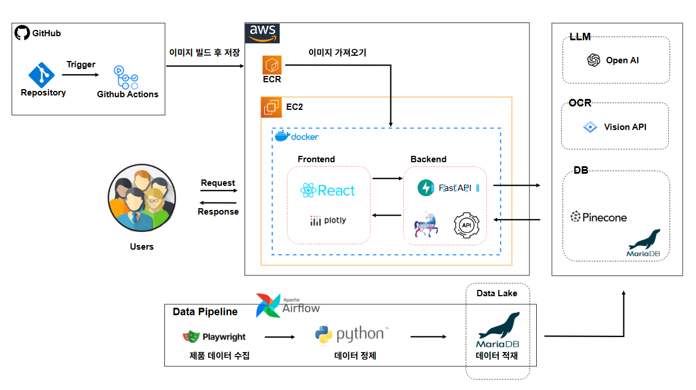
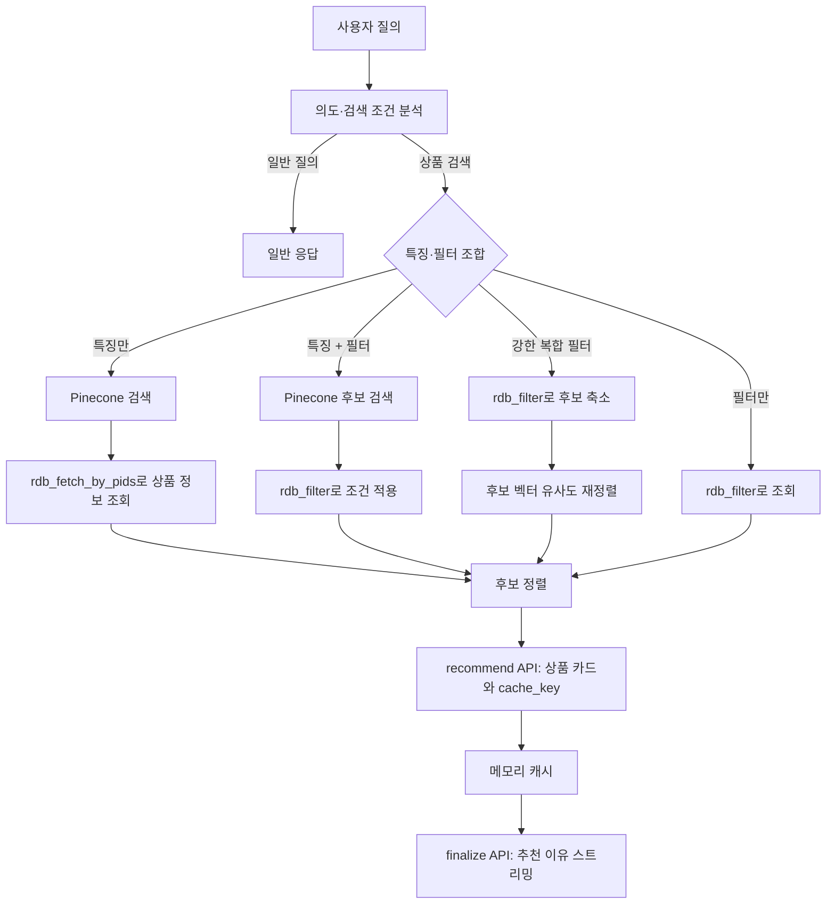
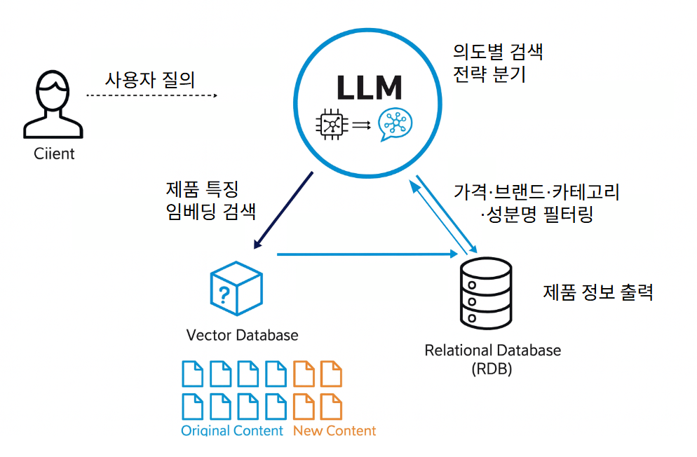
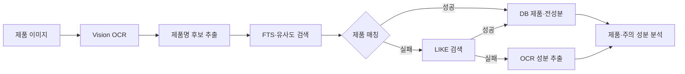
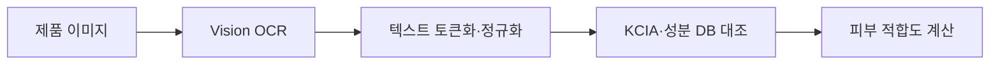
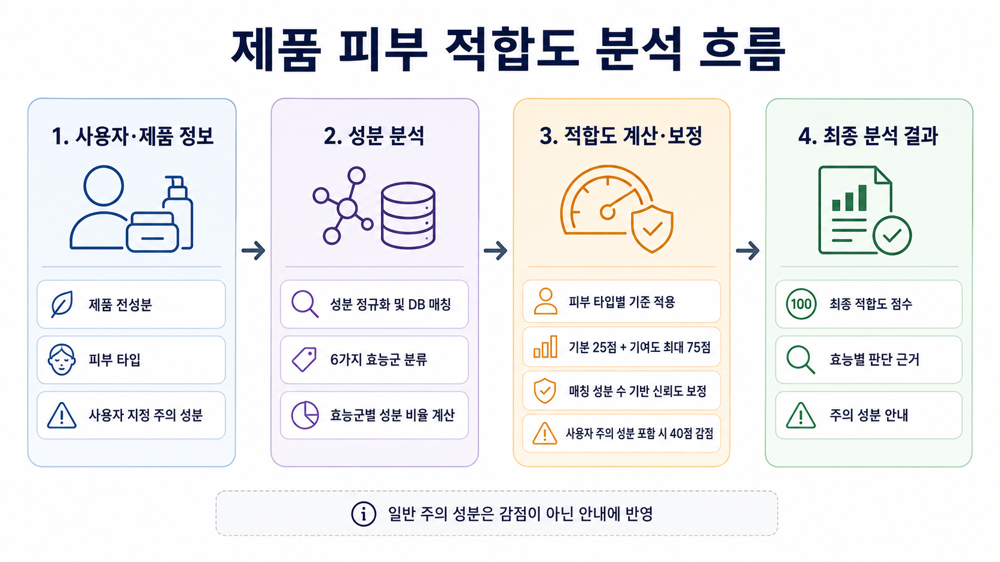
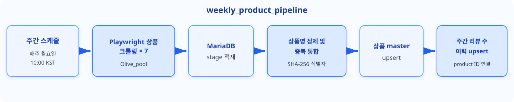
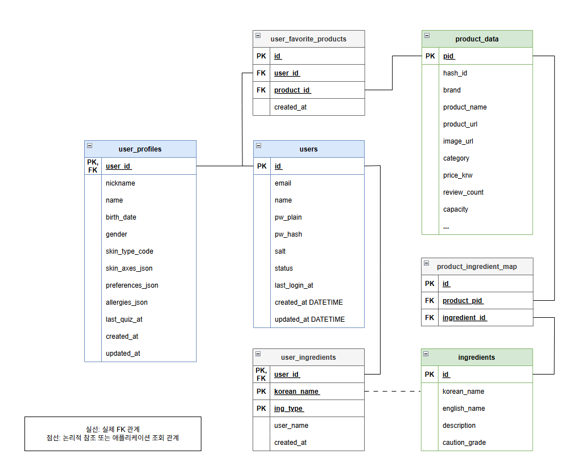

<a id="readme-top"></a>

# Aller

<div align="center">
  
  <h3>자연어 검색과 피부 타입 분석을 결합한 화장품 추천 서비스</h3>
</div>

Aller는 자연어로 입력한 제품 특징과 브랜드·가격·카테고리·성분 조건을 분석해 적합한 화장품을 찾고, 추천 이유를 제공하는 서비스입니다.

<details>
<summary><strong>📋 Table of Contents</strong></summary>

- [팀원 및 역할](#team)
- [프로젝트 소개](#overview)
- [핵심 기능](#features)
- [서비스 화면](#screens)
- [시스템 아키텍처](#architecture)
- [Hybrid RAG 검색 구조](#hybrid-rag)
- [OCR 기반 제품 인식 및 기능 연계](#ocr)
- [제품 피부 적합도 계산](#skin-score)
- [데이터 파이프라인 및 Airflow 자동화](#data-pipeline)
- [핵심 데이터 모델링](#data-model)
- [주요 기술 선택과 한계](#decisions)
- [기술 스택](#tech-stack)
- [실행 방법](#getting-started)

</details>

---

<a id="team"></a>
## 👥 팀원 및 역할

<table>
  <tr>
    <td align="center"></td>
    <td align="center"></td>
    <td align="center"></td>
    <td align="center"></td>
    <td align="center"></td>
  </tr>
  <tr>
    <td align="center"><strong>배형진</strong></td>
    <td align="center"><strong>김지희</strong></td>
    <td align="center"><strong>이은영</strong></td>
    <td align="center"><strong>이정석</strong></td>
    <td align="center"><strong>박상준</strong></td>
  </tr>
  <tr>
    <td align="center">Team Leader · Data Pipeline<br>Hybrid RAG · Deployment</td>
    <td align="center">Frontend · Data Analysis<br>UI/UX · Recommendation</td>
    <td align="center">Frontend · Documentation<br>Recommendation · Testing</td>
    <td align="center">Backend<br>Hybrid RAG · Embedding</td>
    <td align="center">Ingredient DB · Skin Score<br>Presentation · OCR</td>
  </tr>
</table>

---

<a id="overview"></a>
## 📌 프로젝트 소개

Pinecone의 의미 검색과 MariaDB의 조건 검색을 결합해 자연어 요청에 맞는 상품 후보를 탐색합니다. 설문으로 분석한 바우만 피부 타입과 제품 정보를 이용한 적합도 계산, 이미지 OCR을 이용한 제품 분석도 함께 제공합니다.

상품별 주간 리뷰 증가량과 카테고리별 추이를 시각화해 검색 이후의 제품 탐색을 지원합니다.

---

<a id="features"></a>
## 🌟 핵심 기능

| 기능 | 설명 |
| --- | --- |
| 🔎 **Hybrid RAG 화장품 검색 및 AI 채팅** | 자연어 질의에서 제품 특징과 구조화 조건을 분석하고, Pinecone 의미 검색과 MariaDB 조건 검색을 결합해 상품과 추천 이유를 제공합니다. |
| 🧬 **바우만 피부 타입 분석** | 개인 대시보드에서 설문 응답을 16가지 바우만 피부 타입으로 분류하며, 이 결과는 AI 채팅의 Hybrid RAG와 별개인 제품 적합도 계산 기준으로 사용됩니다. |
| 🎯 **제품 피부 적합도 계산** | 제품 성분과 바우만 피부 타입별 기준을 비교해 0~100점의 상대적 적합도를 제공합니다. |
| 📷 **OCR 기반 제품 인식 및 기능 연계** | 제품 이미지의 텍스트를 인식해 AI 채팅의 제품·성분 분석 또는 개인 대시보드의 피부 적합도 계산에 활용합니다. |
| 📊 **상품·리뷰 추이 시각화** | 주간 리뷰 증가량을 바탕으로 최근 소비자 관심 변화가 큰 상품과 카테고리별 추이를 시각화합니다. |


---

<a id="screens"></a>
## 🖥️ 서비스 화면 - 시연 영상

[](https://www.youtube.com/watch?v=w3JsB6KwPug)

---

<a id="architecture"></a>
## 🏗️ 시스템 아키텍처

<div align="center">
  
</div>

- **Frontend**: React와 Vite 기반 사용자 인터페이스
- **Backend**: FastAPI 기반 추천·OCR·피부 분석 API
- **MariaDB**: 상품, 성분, 브랜드, 사용자 등 관계형 데이터 관리
- **Pinecone**: 상품 특징 임베딩을 이용한 의미 검색
- **Application memory**: `/recommend`와 `/finalize` 사이의 검색 후보 임시 보관
- **Deployment**: GitHub Actions를 이용한 frontend/backend 이미지 빌드와 AWS ECR push, Docker Compose 실행 구성

---

<a id="hybrid-rag"></a>
## 🔎 Hybrid RAG 검색 구조

사용자 질의에서 제품 특징과 구조화 조건을 분리한 뒤, 조건 조합에 따라 검색 경로를 선택합니다.


```mermaid
flowchart TD
    A["사용자 질의"] --> B["의도·검색 조건 분석"]
    B -->|"일반 질의"| C["일반 응답"]
    B -->|"상품 검색"| D{"특징·필터 조합"}
    D -->|"특징만"| E["Pinecone 검색"]
    E --> F["rdb_fetch_by_pids로 상품 정보 조회"]
    D -->|"특징 + 필터"| G["Pinecone 후보 검색"]
    G --> H["rdb_filter로 조건 적용"]
    D -->|"강한 복합 필터"| I["rdb_filter로 후보 축소"]
    I --> J["후보 벡터 유사도 재정렬"]
    D -->|"필터만"| K["rdb_filter로 조회"]
    F --> L["후보 정렬"]
    H --> L
    J --> L
    K --> L
    L --> M["recommend API: 상품 카드와 cache_key"]
    M --> N["메모리 캐시"]
    N --> O["finalize API: 추천 이유 스트리밍"]
```

Hybrid RAG의 주요 구성 요소와 저장소 간 관계는 다음 개요에서 확인할 수 있습니다.

<div align="center">
  
</div>

| 질의 조건 | 검색 흐름 |
| --- | --- |
| 상품 특징만 존재 | Pinecone 검색 후 `rdb_fetch_by_pids()`로 상품 정보 조회 |
| 특징과 구조화 조건이 함께 존재 | Pinecone 후보에 `rdb_filter()`로 브랜드·성분·가격·카테고리 조건 적용 |
| 특징과 모든 주요 필터가 존재 | MariaDB에서 후보를 먼저 줄인 뒤 후보 벡터의 유사도로 재정렬 |
| 구조화 조건만 존재 | `rdb_filter()`로 MariaDB 조회 |

`/recommend`는 상품 후보와 `cache_key`를 반환하고 검색 결과를 메모리에 임시 저장합니다. `/finalize`는 캐시된 후보를 우선 사용해 추천 이유를 스트리밍하며, 캐시가 없으면 검색을 다시 수행합니다.

---

<a id="ocr"></a>
## 📷 OCR 기반 제품 인식 및 기능 연계

Google Cloud Vision OCR로 제품 이미지의 텍스트를 추출한 뒤, 사용 기능에 따라 서로 다른 방식으로 후속 처리합니다.

| 사용 기능 | 처리 방식 | 최종 결과 |
| --- | --- | --- |
| **AI 채팅** | 제품 DB 매칭 후 제품 정보와 전성분을 조회하고, 매칭 실패 시 OCR 텍스트에서 성분을 추출합니다. | 제품·성분 및 주의 성분 분석 응답 |
| **개인 대시보드** | OCR 텍스트를 토큰화해 KCIA·성분 DB와 직접 대조합니다. | 피부 타입 기반 적합도 점수 |

### AI 채팅 OCR


```mermaid
flowchart LR
    A["제품 이미지"] --> B["Vision OCR"]
    B --> C["제품명 후보 추출"]
    C --> D["FTS·유사도 검색"]
    D --> E{"제품 매칭"}

    E -->|"성공"| F["DB 제품·전성분"]
    E -->|"실패"| G["LIKE 검색"]
    G -->|"성공"| F
    G -->|"실패"| H["OCR 성분 추출"]

    F --> I["제품·주의 성분 분석"]
    H --> I
```

제품 검색은 FTS 후보의 문자열 유사도를 비교해 `0.6` 이상인 제품을 우선 매칭하고, 찾지 못하면 제품명 후보별 `LIKE` 검색을 수행합니다.

### 개인 대시보드 OCR


```mermaid
flowchart LR
    A["제품 이미지"] --> B["Vision OCR"]
    B --> C["텍스트 토큰화·정규화"]
    C --> D["KCIA·성분 DB 대조"]
    D --> E["피부 적합도 계산"]
```

- **AI 채팅:** `/api/ocr/analyze-image`
- **개인 대시보드:** `/api/analyze-ocr`
- 두 기능은 Google Cloud Vision을 사용하지만 서로 다른 API와 OCR 처리 로직으로 구현되어 있습니다.

---

<a id="skin-score"></a>
## 🎯 제품 피부 적합도 계산

바우만 설문으로 분류한 **16가지 피부 타입**과 제품의 성분 구성을 비교해 **0~100점의 상대적 적합도**를 계산합니다.

직접 선택한 제품의 `/api/analyze`와 이미지로 분석한 제품의 `/api/analyze-ocr`에 동일한 계산 기준이 적용됩니다.

<div align="center">
  
</div>

### 계산 기준

| 구분 | 핵심 기준 |
| --- | --- |
| **효능군** | 성분을 보습·진정·피지·주름·미백·보호로 분류합니다. |
| **효능 비율** | 전체 효능 매칭 횟수에서 각 효능군이 차지하는 비율을 계산합니다. |
| **타입별 평가** | 16가지 피부 타입별 `importance`, `target_min`, `target_max`를 적용합니다. |
| **기여도** | 목표 범위 안에서는 0.90~0.97로 평가하며, 음수 중요도는 목표 상한 초과 시에만 감점에 반영합니다. |
| **점수 계산** | 피부 타입별 기여도 범위로 정규화한 뒤 기본 점수 25점과 성과 점수 75점을 합산하고 올림 처리합니다. |

### 신뢰도 및 감점

| 조건 | 결과 |
| --- | ---: |
| 효능 매칭 **3개 미만** | 분석 중단 |
| 효능 매칭 **3~6개** | 최대 75점 |
| 효능 매칭 **7~9개** | 최대 95점 |
| 효능 매칭 **10개 이상** | 별도 신뢰도 상한 없음 |
| 사용자 지정 주의 성분 포함 | 40점 감점 |
| 최종 결과 | 0~100점으로 제한 |

> 시스템 주의 성분은 분석 결과에 표시하며, 사용자가 직접 지정한 주의 성분이 포함된 경우에만 점수를 감점합니다.

이 점수는 프로젝트에서 정의한 피부 타입별 기준에 따라 제품의 성분 구성을 상대적으로 평가한 값이며, 의학적 진단이나 피부 개선 효과를 의미하지 않습니다.

---

<a id="data-pipeline"></a>
## 🔄 데이터 파이프라인 및 Airflow 자동화

Airflow 파이프라인을 별도로 구현해 상품 데이터 수집부터 MariaDB 갱신까지 주간 단위로 자동화했습니다. 해당 DAG와 크롤러 코드는 현재 공개 저장소에 포함되어 있지 않습니다.

<p align="center">
  
</p>

- `weekly_product_pipeline`은 매주 월요일 오전 10시(KST)에 실행됩니다.
- 4개 카테고리를 페이지 범위에 따라 7개의 Playwright 크롤링 task로 나누어 처리합니다.
- 크롤링 task는 `Olive_pool`을 사용하며, 모든 task가 완료된 뒤 상품 데이터를 정제하고 갱신합니다.
- 정제된 상품명의 SHA-256 기반 식별자로 중복 상품을 통합하고 `INSERT ... ON DUPLICATE KEY UPDATE` 방식으로 저장합니다.
- 상품별 누적 리뷰 수를 제품 ID와 해당 주 월요일 기준일에 연결해 이력 테이블에 upsert합니다.

저장된 이력은 이전 주와 현재 주의 누적 리뷰 수 차이를 계산해 상품별 리뷰 증가량과 카테고리별 추이를 시각화하는 데 사용합니다. 리뷰 증가량은 최근 소비자 관심 변화를 살펴보는 간접 지표입니다. 현재 자동화 범위에는 리뷰 본문 수집, 임베딩 생성, Pinecone upsert가 포함되어 있지 않습니다.

---

<a id="data-model"></a>
## 🗃️ 핵심 데이터 모델링

Aller의 전체 데이터베이스 중 사용자 맞춤 성분 관리, 상품 즐겨찾기, 상품–성분 연결에 사용되는 핵심 테이블과 관계를 선별해 표현했습니다.



Hybrid RAG 추천 검색은 `product_data_chain`과 상품·성분 관계 데이터를 사용합니다. 피부 타입 기반 적합도 계산과 일반 상품 조회에는 `product_data`를 사용합니다. 별도 Airflow 파이프라인의 stage 및 리뷰 이력 테이블은 현재 공개 저장소의 애플리케이션 모델에 포함되어 있지 않습니다.

---

<a id="decisions"></a>
## ⚖️ 주요 기술 선택과 한계

### 검색 경로 분리

특징 중심 질의는 Pinecone에서 의미 기반으로 검색하고, 가격·브랜드·카테고리·성분처럼 정확한 조건은 MariaDB에서 처리합니다. 주요 조건이 모두 포함된 질의는 MariaDB 후보를 먼저 제한한 뒤 해당 후보의 벡터 유사도로 순서를 조정합니다.

### 동적 페이지 수집과 중복 갱신

상품 페이지의 탭 클릭, 스크롤, selector 대기와 페이지네이션을 처리하기 위해 Playwright를 사용했습니다. 수집 결과는 stage 테이블에 적재하고, 정제된 상품명을 기준으로 통합한 뒤 upsert합니다.

### 현재 한계

- 정제된 상품명만으로 hash ID를 생성하므로 브랜드나 용량이 다른 동명 상품이 합쳐질 수 있습니다.
- 일부 페이지·상품 오류를 건너뛰기 때문에 부분 수집 상태에서도 크롤링 task가 성공할 수 있습니다.
- 상품과 리뷰 이력 upsert는 하나의 transaction으로 묶여 있지 않습니다.
- Airflow DAG에는 자동 재시도와 Pinecone upsert가 포함되어 있지 않습니다.

---

<a id="tech-stack"></a>
## 🛠️ 기술 스택

### Frontend


### Backend


### AI · RAG


### Data Pipeline · Database


### Infrastructure · Deployment


---

<a id="getting-started"></a>
## 🚀 실행 방법

### 1. 저장소 클론 및 Python 환경 구성

```bash
git clone https://github.com/bhjin97/Team-Grow.git
cd Team-Grow
conda env create -f environment.yml
conda activate grow
```

### 2. Backend 실행

```bash
cd backend
uvicorn main:app --reload
```

Backend는 사용하는 기능에 따라 MariaDB, OpenAI, Pinecone, Google Cloud Vision 관련 환경변수와 인증 정보가 필요합니다. 실제 비밀값은 저장소에 포함하지 않습니다.

### 3. Frontend 실행

```bash
cd frontend
npm install
npm run dev
```

필요한 경우 `VITE_API_BASE`로 Backend 주소를 지정합니다. 별도 Airflow 파이프라인은 현재 저장소의 기본 실행 절차에 포함되지 않습니다.

<p align="right">(<a href="#readme-top">back to top</a>)</p>
