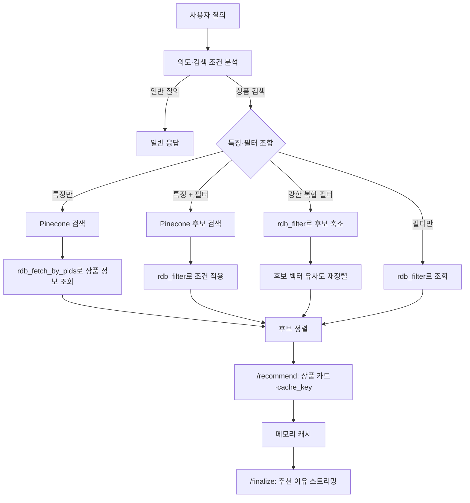

<a id="readme-top"></a>

# Aller

<div align="center">
  
  <h3>자연어 조건을 분석해 화장품을 탐색하고 추천 이유를 제공하는 Hybrid RAG 서비스</h3>
</div>

Aller는 사용자의 자연어 요청에서 상품 특징과 브랜드·가격·카테고리·성분 조건을 분리하고, 조건에 맞는 검색 전략으로 후보를 찾습니다. Pinecone의 의미 검색과 MariaDB의 구조화된 필터를 결합한 뒤, 후보 상품 데이터를 바탕으로 추천 결과를 생성합니다.

## 목차

- [1. 프로젝트 소개](#1-프로젝트-소개)
- [2. 핵심 특징](#2-핵심-특징)
- [3. 시스템 아키텍처](#3-시스템-아키텍처)
- [4. Hybrid RAG 검색 구조](#4-hybrid-rag-검색-구조)
- [5. 데이터 파이프라인 및 Airflow 자동화](#5-데이터-파이프라인-및-airflow-자동화)
- [6. 주요 기술 선택과 한계](#6-주요-기술-선택과-한계)
- [7. 담당 역할](#7-담당-역할)
- [8. 기술 스택](#8-기술-스택)
- [9. 데이터 모델](#9-데이터-모델)
- [10. 실행 방법](#10-실행-방법)

## 1. 프로젝트 소개

### 주요 기능

- 자연어 기반 화장품 조건 검색 및 추천 이유 생성
- 설문 기반 바우만 피부 타입 분석과 상품 적합도 조회
- 이미지 OCR을 이용한 화장품 성분 추출 및 성분 정보 조회
- 향수 추천, 케어 루틴, 상품·리뷰 통계 시각화

### 서비스 화면


### 팀 멤버

<div align="center">

|  |  |  |  |  |
| :---: | :---: | :---: | :---: | :---: |
| **배형진** | **김지희** | **이은영** | **이정석** | **박상준** |

</div>

## 2. 핵심 특징

- **질의 의도 분리**: 일반 대화와 상품 검색 요청을 구분하고 상품 검색에 필요한 조건을 구조화합니다.
- **다중 검색 전략**: 특징과 필터의 조합에 따라 Vector-first, Vector+RDB, RDB-first, Filter-only 경로를 선택합니다.
- **검색 결과 결합**: Pinecone의 의미 유사도와 MariaDB의 상품·성분·브랜드·가격 조건을 함께 사용합니다.
- **두 단계 응답**: `/recommend`가 상품 후보와 캐시 키를 반환하고, `/finalize`가 저장된 후보를 이용해 추천 이유를 스트리밍합니다.
- **주간 데이터 갱신**: 별도로 구현한 Airflow 파이프라인이 4개 카테고리의 상품 정보와 리뷰 수를 수집해 MariaDB를 갱신합니다.

## 3. 시스템 아키텍처

<div align="center">
  
</div>

- **Frontend**: React와 Vite 기반 사용자 인터페이스
- **Backend**: FastAPI API와 질의 분석·추천·OCR·피부 분석 기능
- **MariaDB**: 상품, 성분, 브랜드, 사용자 등 관계형 데이터 조회
- **Pinecone**: 상품 특징 임베딩을 이용한 의미 기반 검색
- **Application memory**: `/recommend`와 `/finalize` 사이의 후보 결과를 임시 보관
- **Deployment**: GitHub Actions에서 frontend/backend 이미지를 빌드해 AWS ECR로 push하고, Docker Compose로 실행하는 배포 구성

> Airflow 파이프라인은 프로젝트 과정에서 별도로 구현되었으며 현재 공개 저장소에는 DAG와 크롤러 코드가 포함되어 있지 않습니다.

## 4. Hybrid RAG 검색 구조

기존 이미지는 Vector DB와 RDB를 함께 사용하는 개념을 보여줍니다. 실제 애플리케이션은 질의에 포함된 특징과 구조화 조건에 따라 검색 경로를 나눕니다.

<div align="center">
  
</div>


```mermaid
flowchart TD
    A["사용자 질의"] --> B["의도·검색 조건 분석"]
    B -->|"일반 질의"| C["일반 응답"]
    B -->|"상품 검색"| D{"특징·필터 조합"}
    D -->|"특징만"| E["Pinecone 검색"]
    E --> F["rdb_fetch_by_pids로 상품 정보 조회"]
    D -->|"특징 + 필터"| G["Pinecone 후보 검색"]
    G --> H["rdb_filter로 조건 적용"]
    D -->|"강한 복합 필터"| I["rdb_filter로 후보 축소"]
    I --> J["후보 벡터 유사도 재정렬"]
    D -->|"필터만"| K["rdb_filter로 조회"]
    F --> L["후보 정렬"]
    H --> L
    J --> L
    K --> L
    L --> M["/recommend: 상품 카드·cache_key"]
    M --> N["메모리 캐시"]
    N --> O["/finalize: 추천 이유 스트리밍"]
```

| 질의 조건 | 검색 흐름 |
| --- | --- |
| 상품 특징만 존재 | Pinecone 검색 후 `rdb_fetch_by_pids()`로 상품 정보 조회 |
| 특징과 구조화 조건이 함께 존재 | Pinecone 후보에 `rdb_filter()`로 브랜드·성분·가격·카테고리 조건 적용 |
| 특징과 모든 주요 필터가 존재 | MariaDB에서 후보를 먼저 줄인 뒤 Pinecone 벡터로 유사도 재정렬 |
| 구조화 조건만 존재 | `rdb_filter()`로 MariaDB 조회 |

추천 API는 후보와 중간 결과를 메모리 캐시에 저장합니다. 최종 응답 API는 캐시된 후보를 우선 사용하고, 캐시가 없으면 검색을 다시 수행한 뒤 후보의 `rag_text`를 바탕으로 추천 이유를 스트리밍합니다.

## 5. 데이터 파이프라인 및 Airflow 자동화

현재 공개 저장소에는 포함되어 있지 않지만, 프로젝트 과정에서 별도로 구현한 Airflow 파이프라인과 실행 로그를 통해 주간 데이터 수집 및 MariaDB 갱신 자동화를 확인했습니다.

`4개 카테고리 크롤링 → MariaDB stage 적재 → 상품명 정제·중복 통합 → 상품 upsert → 주간 리뷰 수 이력 upsert`

- DAG `weekly_product_pipeline`은 매주 월요일 오전 10시(KST)에 실행됩니다.
- 스킨/토너, 에센스/세럼/앰플, 크림, 선크림을 페이지 범위에 따라 7개 Playwright 크롤링 task로 나눕니다.
- 7개 task는 `Olive_pool`을 사용하며, 모두 성공한 뒤 `upsert_master`가 실행됩니다.
- 상품명 정제 후 SHA-256 기반 식별자로 중복 데이터를 통합하고 `INSERT ... ON DUPLICATE KEY UPDATE`로 갱신합니다.
- 상품별 리뷰 수를 제품 ID와 연결해 주간 이력으로 저장합니다.

| 구분 | 구현 내용 | Airflow 자동화 |
| --- | --- | :---: |
| 상품 수집 | 4개 카테고리의 상품 상세 정보 수집 | O |
| 상품 정제 | 상품명 정제 및 중복 통합 | O |
| MariaDB | stage 및 상품 데이터 upsert | O |
| 리뷰 이력 | 상품별 주간 리뷰 수 갱신 | O |
| 임베딩 생성 | 해당 DAG에서 확인되지 않음 | X |
| Pinecone upsert | 해당 DAG에 포함되지 않음 | X |

현재 DAG는 `retries=0`이며 자동 재시도나 실패 데이터 복구를 구현한 것으로 표현하지 않습니다. 리뷰 본문 수집과 Pinecone vector upsert 역시 이 DAG의 자동화 범위에 포함되지 않습니다.

## 6. 주요 기술 선택과 한계

### 검색 경로 분리

의미가 중요한 특징 질의는 Pinecone을 사용하고, 가격·브랜드·카테고리·성분처럼 정확한 조건은 MariaDB에서 처리합니다. 강한 복합 조건에서는 RDB 후보를 먼저 제한해 해당 후보의 벡터만 비교합니다.

### 동적 페이지 수집과 중복 갱신

상품 페이지의 탭 클릭, 스크롤, selector 대기가 필요해 Playwright를 사용했습니다. 수집 결과는 stage 테이블에 적재한 뒤 정제된 상품명을 기준으로 통합하고 upsert합니다.

### 확인된 한계

- 정제된 상품명만으로 hash ID를 만들기 때문에 브랜드나 용량이 다른 동명 상품이 합쳐질 가능성이 있습니다.
- 일부 페이지·상품 오류를 건너뛰는 구조여서 부분 수집 상태에서도 크롤링 task가 성공할 수 있습니다.
- 상품과 리뷰 이력 upsert는 하나의 원자적 transaction으로 묶여 있지 않습니다.
- Airflow DAG에는 자동 재시도와 Pinecone upsert가 포함되어 있지 않습니다.

## 7. 담당 역할

### 배형진

- 전성분 데이터를 제외한 제품 및 리뷰 데이터 파이프라인 담당
- Playwright 기반 상품 정보·리뷰 수 수집부터 정제, 중복 처리, MariaDB 적재 및 주간 이력 갱신까지 Airflow로 자동화
- 이정석 팀원과 Hybrid RAG 통합·수정 및 Pinecone 검색 구조 공동 설계
- Docker/ECR 기반 배포 환경 단독 구성

## 8. 기술 스택

| 구분 | 기술 | 역할 |
| --- | --- | --- |
| Frontend | React, TypeScript, Vite | 사용자 인터페이스와 결과 시각화 |
| Backend | FastAPI, SQLAlchemy, PyMySQL | API, 관계형 데이터 조회 및 서비스 로직 |
| AI / RAG | OpenAI, LangChain, Pinecone | 질의 분석, 의미 검색, 최종 응답 생성 |
| Database | MariaDB | 상품·성분·브랜드·사용자 데이터 관리 |
| Data Pipeline | Airflow, Playwright | 별도 주간 크롤링 및 MariaDB 갱신 파이프라인 |
| Infrastructure | Docker, GitHub Actions, AWS ECR | 컨테이너 이미지 빌드·배포 |

## 9. 데이터 모델


현재 애플리케이션의 추천 검색은 `product_data`를 비롯한 상품·성분 관계 데이터를 사용합니다. 별도 파이프라인의 stage 및 리뷰 이력 테이블은 현재 공개 저장소의 모델에 포함되어 있지 않습니다.

## 10. 실행 방법

### 1. 저장소 클론 및 Python 환경 구성

```bash
git clone https://github.com/bhjin97/Team-Grow.git
cd Team-Grow
conda env create -f environment.yml
conda activate grow
```

### 2. Backend 실행

```bash
cd backend
uvicorn main:app --reload
```

Backend는 MariaDB, OpenAI, Pinecone 및 Google Cloud Vision 등 사용하는 기능에 맞는 환경변수와 인증 정보가 필요합니다. 실제 비밀값은 저장소에 포함하지 않습니다.

### 3. Frontend 실행

```bash
cd frontend
npm install
npm run dev
```

필요한 경우 `VITE_API_BASE`로 Backend 주소를 지정합니다. 별도 Airflow 구현은 현재 저장소의 기본 실행 절차에 포함되지 않습니다.

<p align="right">(<a href="#readme-top">back to top</a>)</p>
